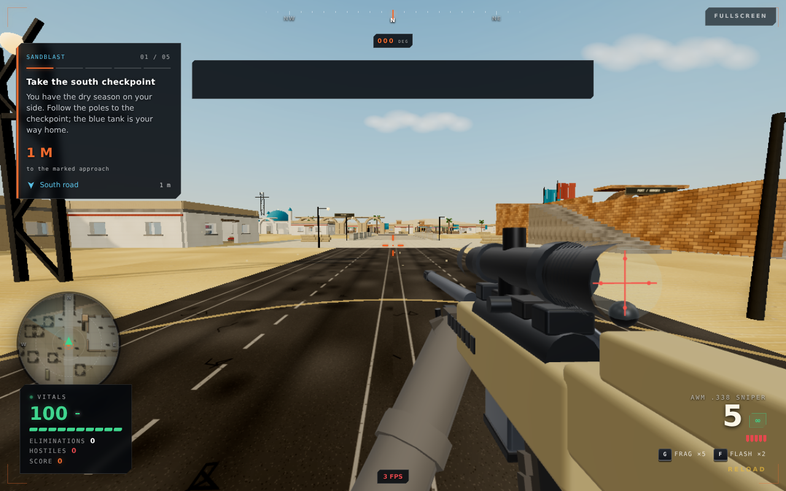
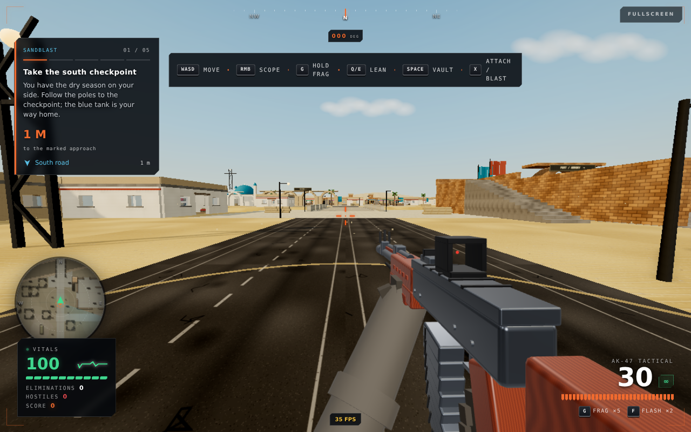
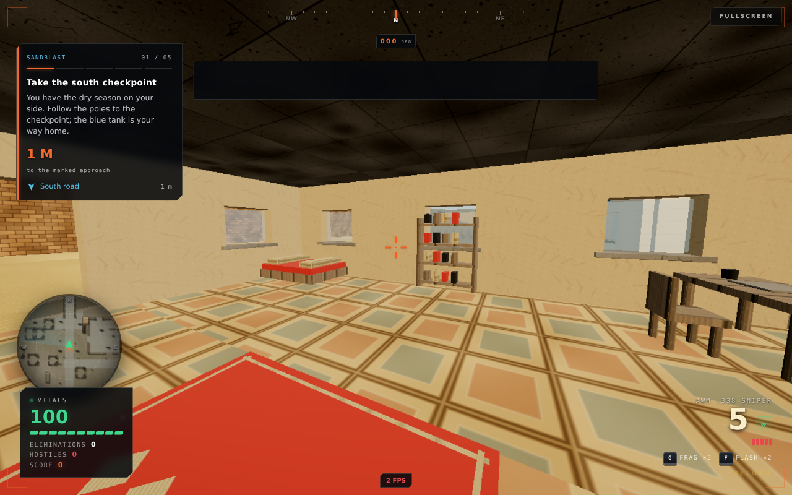
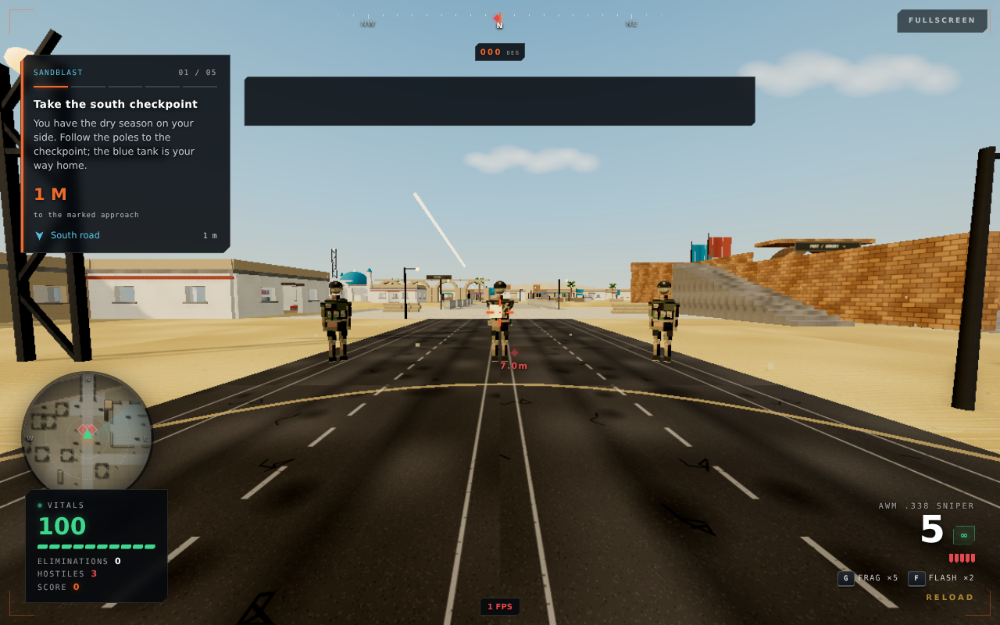

# Combat and visual refinement

This pass follows the rejected Ground Zero delivery. It fixes concrete rendering and gameplay defects; it is not a claim that the game has become photorealistic or that every collision has been exhaustively checked.

## What changed

- **AWM:** its main geometry builder was never flushed. The chassis, barrel, stock, bolt and bipod now actually render. Added mounts, stock rails, receiver details and an open-ended scope housing.
- **Weapons:** bevelled parts, smoother cylinders, deterministic wood grain, reflection lighting, corrected AK dust-cover ribs, segmented curved magazine and receiver rivets. Enemy rifles now have furniture, magazines, sights and a real muzzle attachment. ADS uses a small clear red dot instead of the large glowing ring.
- **World:** removed the central fountain and both water-well props; replaced them with open market/shelter space. Rectangular surface overlays are clipped against preceding coplanar patches rather than stacked. Wall texture scale is tied to dimensions, buried facade strips are moved outside the wall, and opaque fake contact-shadow planes are removed. Lighting has less ambient washout.
- **Interiors:** furnished ground and upper floors, divans, pillows, open-legged tables and chairs, papers, cups, stocked shelves, bordered rugs, beams and hanging light fixtures. The upper-floor slab now has a stairwell opening. East/west doorways are kept clear of bookshelves.
- **Collision:** horizontal movement is subdivided so fast movement cannot jump through thin walls. Movement and support use the same 0.55 m step allowance; support uses the capsule footprint. Existing elevated access routes remain tested.
- **Animation and combat:** knees articulate independently, soles no longer start below ground, gait advances on the visual clock and persists between staggered AI updates. Corrected aiming arms that previously pointed behind the soldier. Gun recoil and larger muzzle bursts accompany shots. Short pooled tracer streaks travel downrange. Enemy fire originates at the rifle muzzle and checks obstruction before damaging the player.
- **AI:** close visible contact interrupts flanking/retreating instead of sending enemies away. Nearby enemies fire without first reaching distant cover. Enemies can fire while approaching cover; squad roles approach on separate sides and locally separate rather than piling onto one waypoint.
- **Demolition:** tap X to start attaching. Keep the target visible and in range to finish; releasing X does not cancel work, and leaving cover saves progress. Once armed, get beyond the clearance radius and press X again to trigger the blast, or let the backup fuse run. A held key cannot immediately detonate it. HUD/control hints explain the new interaction.

## Verification

- Production build, lint, TypeScript, **45 tests**, **31 mutation checks**.
- Regression checks for missing sniper geometry, finite weapon meshes, thin-wall tunnelling, shared stair allowance, travelling/recycled tracers, close-contact engagement, persistent gait and separate squad approach lanes.
- Updated demolition tests cover rejected taps through cover, retained work, hands-free continuation, fresh-press remote activation, clearance lockout and timed fallback.
- Browser checks on both maps: five weapons fire; vault/glass, lean, slide, frag, flash and pause work. Assisted mission runs reached extraction, changed collision/radar on demolition, redeployed and exercised mission failure. No page errors in mission/capture probes.
- Existing 18 elevated access routes and all configured squad insertion positions remain under geometry/navigation tests.

### Budget accounting

Furnishing rooms costs geometry. The old 80k/40k world-triangle ceilings were deliberately revised to 95k/50k, while retaining the **20 world-draw ceiling**. Measured intact/destroyed geometry: Alrasul **91,730 / 92,352 triangles**, Kasbah **46,988 / 47,814 triangles**. These are world geometry counts, **not full-frame draw counts or FPS measurements**. The existing soldier budget and ten-actor pool ceiling remain enforced.

### Actual browser captures

These are staged in-engine captures, not concept art. Cameras and enemy placement were controlled by a local QA harness. Paused capture FPS/HUD state is not representative of play performance.

## Boundaries

The maps still use procedural low-poly architecture, not a replacement commercial art pack. Tracers are travelling visual feedback; damage remains hitscan. This is not a skeletal mocap animation system. Automated and assisted browser probes do not replace an unassisted human Normal-difficulty run or integrated-GPU performance testing. No universal “all collisions fixed” or minimum-FPS claim is made.
