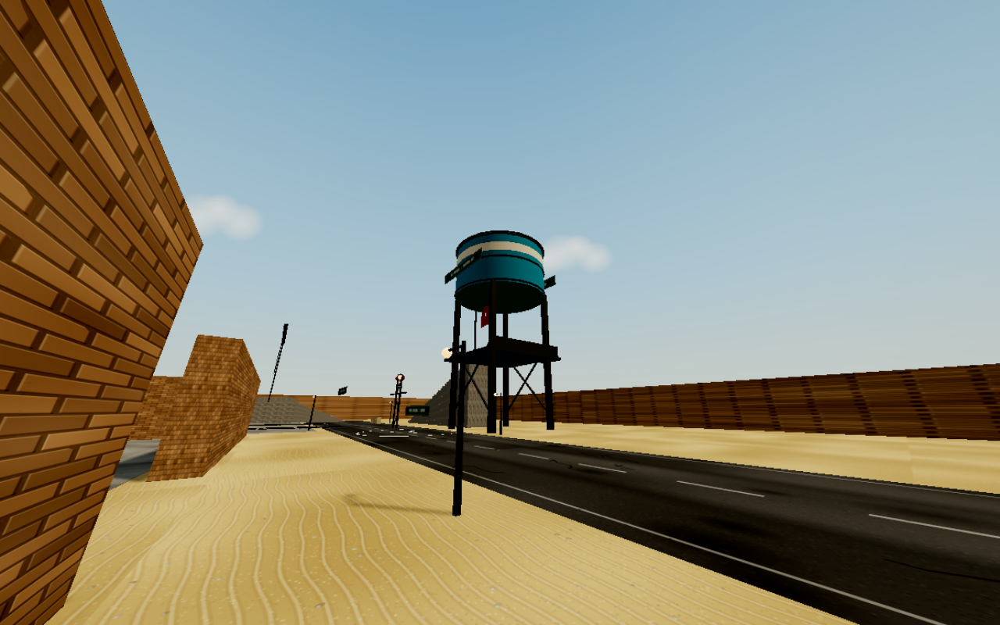
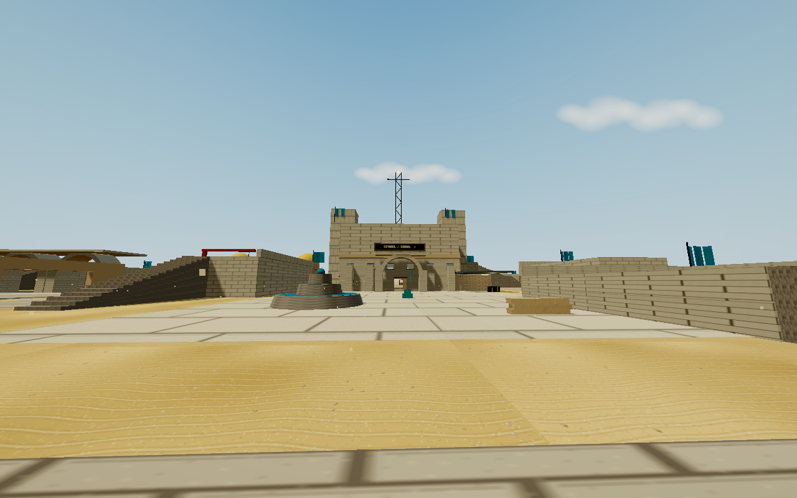
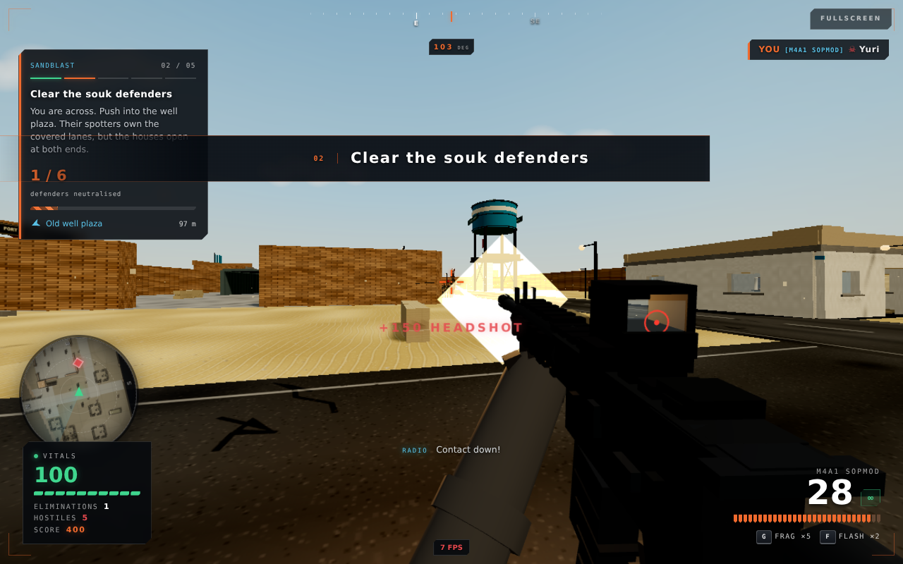
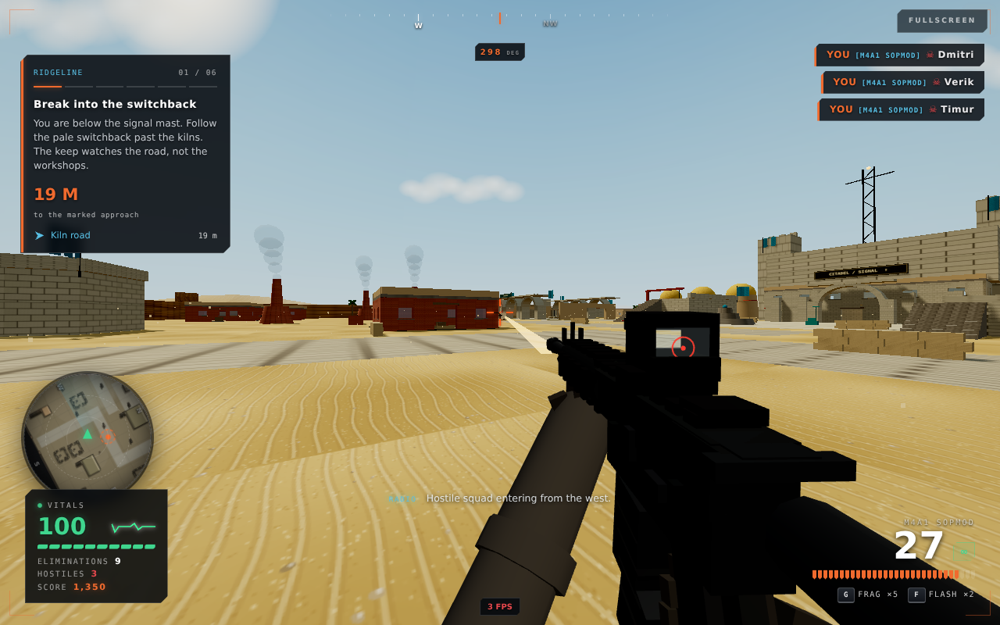
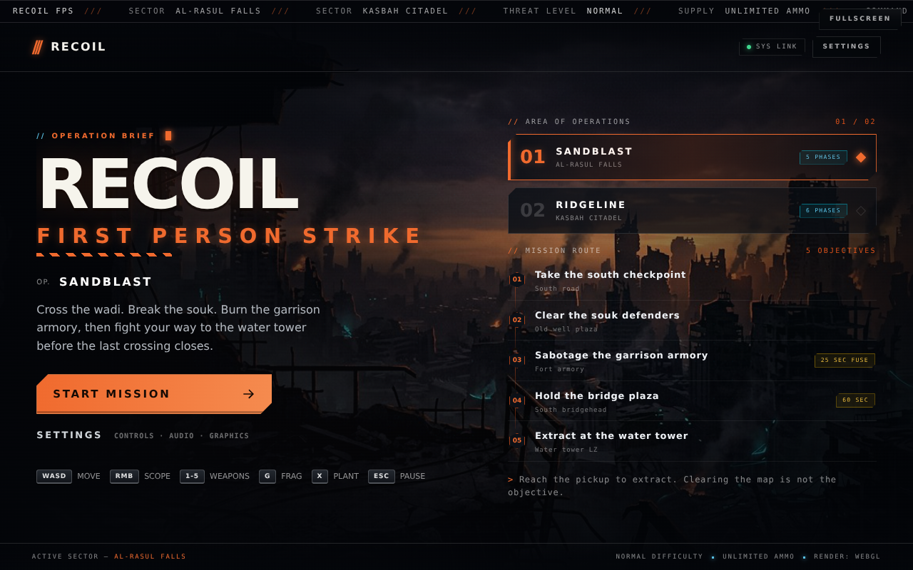
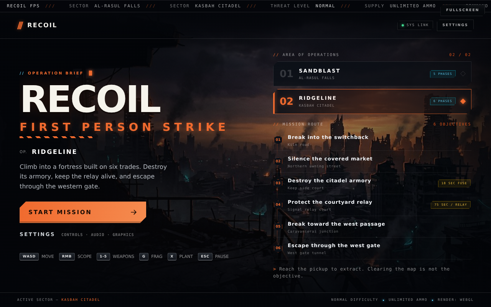

# Ground Zero — map and mission rebuild

## What changed

This implements the map/mission brief against the actual Three.js game, preserving the weapon, movement, pause, reinforcement and scoring contracts established in `phase-1.md` and `phase-2.md`. It does not reset the existing UI to an earlier design prompt.

### Al-Rasul Falls / Operation Sandblast

A diagonal, 2.5 m-deep wadi separates the old souk from the garrison and rail-service quarter. The road bridge is covered; the timber footbridge is narrow and exposed. The old town has a well court, colored market awnings, arcades, a prayer hall, through-house routes and three accessible roofs. The south bank has an open-gated fort, lit armory, two accessible fort decks, three freight lanes, loading crane and a 25 m water-tower silhouette.

**Route:** south checkpoint → souk defenders → garrison armory → bridgehead hold → water-tower landing zone.

- Six designated defenders; 2.5 s plant; 25 s fuse; 60 s hold.
- A western reinforcement request follows the clear phase.
- Detonation removes the timber crossing, leaves physical rubble in the bed, and changes its collision, bullet occlusion, footsteps and navigation together.
- Extraction is at the tower, not the deployment point. Municipal tank bands, a serial plaque, painted landing circle and windsock identify it.
- Seven authored elevated positions, all tested with the engine's capsule and support code.

### Kasbah Citadel / Operation Ridgeline

A taller stone keep and signal mast overlook accessible 2.5 / 5 / 7.5 m terrace decks. The surrounding districts are deliberately different: glowing brick kilns, teal caravanserai arcades, ochre granary silos, covered northern market, plum-colored tannery vats and terracotta pottery workshops. The west exit is a covered, 25 m-long gate passage.

**Route:** switchback → northern market → keep armory → protect courtyard relay → caravanserai junction → western gate.

- Eight designated defenders; 3 s plant; 18 s fuse; 75 s relay defense.
- **Defend is not hold:** the timer continues whether you are inside or outside. Each living hostile inside the objective drains four integrity points per second from a 100-point relay. Zero integrity fails the mission; reaching the deadline with positive integrity advances it. Leaving the circle is allowed; abandoning the relay is not.
- The relay has a physical radio/antenna prop. The marker and HUD turn into an explicit overrun warning when contested.
- Detonation drops the granary hoist across a real shortcut. The wider western approach stays connected.
- Eleven authored elevated positions, all tested with the actual collision/support methods.

## Integration details

### World contract and destruction

The existing world arrays remain authoritative. `groundHeight(x,z)` adds a shared support surface for the wadi. `detonate()` is an idempotent, event-driven transition; `changed` exposes its state. `landmarks` and `overlooks` document the authored positions and exact climb routes.

Intact and destroyed geometry are built once and merged by material. Bounds are preallocated and disabled/enabled in place. On the demolition event:

1. The mission marker removes the cache.
2. The world swaps the crossing/hoist geometry and collider state.
3. The existing grenade blast resolves damage, glass, particles and audio.
4. The engine refreshes its collision hash, the existing NavGrid's blocked cells, enemy paths, radar image and hittables.

The NavGrid remains two-dimensional. Its collider height test is now relative to the local ground surface so rubble below street level is not invisible to navigation. Pooled soldiers keep the same grid reference. Terrain support is also used for grenade landing, grenade preview and death decals.

Smoke is a static transparent material batch, **not** an occluder or a collider. This distinction is regression-tested: a cosmetic plume must not become bulletproof cover.

### Materials and atmosphere

Procedural stone block, fired brick, packed-earth render, corrugated metal, rough timber, cracked riverbed, cobble and terrace pavers supplement the existing palette. Packed earth is shared with trampled service paths rather than spending another draw on a nearly identical material. A single procedural sign atlas carries district names and wayfinding. Folded banners, kiln coals, lanterns, mast beacons, railway sleepers and braced structures supply small-scale detail.

Untextured accents share vertex-color batches instead of allocating a draw per accent color. Clouds are soft textured sprites, replacing the opaque-looking ellipsoids, and their group drifts in simulation time. Al-Rasul uses warmer haze; Kasbah uses cooler haze. The nearest-two real-light policy is unchanged.

### Presentation and preservation

- Menu names, descriptions/tooltips and timing chips come from the new definitions; the six-phase route fits short desktop viewports, with scrolling available when needed.
- Defense integrity is exposed in HUD and pause readouts. Existing exact extraction guidance and all phase titles remain in SSR output.
- Kill-feed placement no longer overlaps Fullscreen; FPS has its own bottom-center slot.
- FPS sampling uses real frame duration, not the physics timestep's 50 ms clamp. The old clamp could disguise a sub-20 FPS renderer.
- Infinite reserves, all five recoil arrays, starting grenade counts, soldier geometry, lean/vault/slide mechanics, damage, spawn visibility checks and the ten-live pool cap remain intact.
- The frame-zero roster is still empty. A guarded, idempotent opening request asks the existing pressure director for three actors; no spawn-safety rule is bypassed. Both browser runs produced three opening actors.

## Verification

### Automated gates

Executed successfully:

- `npm run build`
- `npx tsc --noEmit`
- `node --test` — **40 tests**
- `node scripts/validate.mjs` — lint, typecheck, tests and **31 assertion-detected mutations**, followed by a restored-source baseline

New coverage includes:

- Defense drain, success, zero-integrity failure, pause/death, oversized timesteps, invalid inputs, HUD values and 20-minute success/failure simulations.
- Runtime filtering of dead, distant and vertically separated actors; exactly-once opening presence and failure delivery.
- Every elevated approach/landing using `Engine.moveAxis` and `Engine.supportHeight`, not merely a list of claimed roof positions.
- All three members of all 14 insertion sites per map, on the actual 2 m grid, before and after demolition; deployment distance and capsule clearance.
- Independent 0.5 m flood-fill of all objective regions, including after route destruction.
- BVH raycasts across destroyed geometry, idempotence, non-growing collider arrays, glass/window alignment, cover bounds and world/marker budgets.

### Geometry comparison

These are **visible world geometry counts**, including instanced glass. They are not whole-frame draw counts, shadow-pass counts or FPS measurements. The baseline was constructed from commit `f6b6f2e` using the same Node geometry-count method.

| Map / state | World draws | World triangles |
|---|---:|---:|
| Original Al-Rasul | 35 | 70,928 |
| New Al-Rasul, intact | 20 | 76,024 |
| New Al-Rasul, destroyed | 20 | 76,646 |
| Original Kasbah | 32 | 35,476 |
| New Kasbah, intact | 19 | 36,492 |
| New Kasbah, destroyed | 20 | 37,318 |

Kasbah does not need the dense bank geometry used by the wadi, so its distant sand retains a cheaper mesh. Both maps keep 40 ground-level cover nodes. Al-Rasul has 259 glass/window entries; Kasbah has 188. Soldier and mission-object budgets are unchanged; the relay fits the fourth marker draw.

### Browser verification — assisted, not human playtesting

Chromium ran with software SwiftShader. Native mouse capture was blocked in this headless environment; the harness supplied a synthetic lock only inside the test page. No cheat/debug hook or browser dependency was added to the shipped game.

| Check | Al-Rasul | Kasbah |
|---|---|---|
| Deploy and opening pressure | 3 live / 3 spawned | 3 live / 3 spawned |
| Full runtime objective sequence | 5 phases → complete | 6 phases → complete |
| Actual plant visibility and fuse event | Passed | Passed |
| Destruction and radar regeneration | Passed | Passed |
| Peak live during assisted sequence | 9 | 9 |
| Results, fresh redeployment, lethal-damage failure | Passed | Passed |
| Five weapons each fire through existing weapon methods | Passed | Passed |
| Vault breaks its corresponding pane | Passed | Passed |
| Q/E clearance queries at three cover positions | Passed | Passed |
| Slide initiation; frag cook/release; flash throw | Passed | Passed |
| Paused frame does not advance mission time | Passed | Passed |
| JavaScript page exceptions during runtime sequence | None | None |

The full-sequence harness **relocated the player, supplied elimination credits and advanced simulation time**. It validates wiring, not difficulty or route pacing. Separate assisted combat runs used real spawned actors, AI, weapon raycasts and damage; Al-Rasul recorded one elimination, and Kasbah nine. They do not establish a balanced human playthrough.

The screenshots are actual game/menu renders, not concept art. Landmark captures use a relocated camera with the viewmodel/HUD hidden. Software rendering and blocked font downloads may differ from a normal desktop browser.

## Deliberate adaptations and remaining acceptance work

This is a substantial rebuild, **not a claim that every aspirational sentence in the supplied brief has been met**:

- Kasbah's elevation is authored terrace decks and ramparts surrounding ground-connected courts/roads, not an entirely raised continuous hill town. This preserves the brief's independent ground-level objective flood test and the existing ground-based AI. A truly continuous elevated campaign would require a broader nav/objective contract change.
- Tower access uses real stairs rather than an unimplemented ladder mechanic. Every advertised overlook can actually be reached.
- The wadi has continuous ramped banks. The two bridges are the covered/fast street-level crossings, not magical barriers preventing traversal of a dry riverbed.
- The footbridge/hoist state changes are instantaneous at detonation, with persistent debris and smoke, not animated rigid-body collapses. No additional physics engine was introduced.
- The first-contact window, 70% landmark visibility target, sightline balance and relay difficulty still need human playtesting. The mandatory pre-edit human playthroughs were not possible here and are not claimed.
- **The >55 FPS / integrated-GPU acceptance target is unverified.** Software-renderer screenshots and geometry budgets cannot establish it. Fullscreen, real pointer-lock input, all graphics paths, settings on actual hardware, and two complete unassisted Normal runs remain release checks.
- The install reported the same two dependency audit advisories (one low, one high). No forced dependency upgrade or package manifest change was made as part of this map rebuild.

### Human release checklist

1. Play both operations on Normal without harness assistance; assess first contact, radio timing and the western flank.
2. Verify all stairs, vaults, three lean spots, frag/flash, five weapons, pause/settings/resume, death and redeployment with real pointer lock.
3. Sprint the densest market while profiling complete renderer/shadow/postprocessing work on an integrated GPU; record minimum and typical FPS.
4. Watch each reinforcement approach for 30-second stalls and verify offscreen arrivals under different player sightlines.
5. Check radar at its normal zoom during the bridge collapse and hoist blockage; assess readability rather than only geometric correctness.
6. Tune the 75-second relay defense from observed player outcomes, without weakening the spawn or actor budgets.
