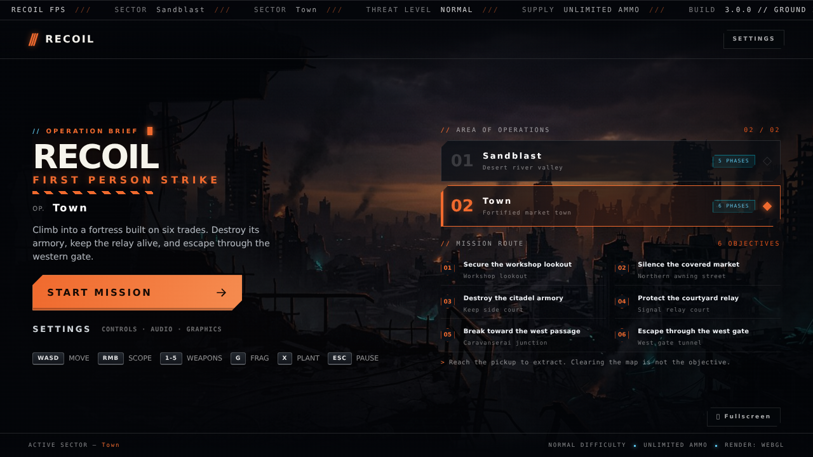
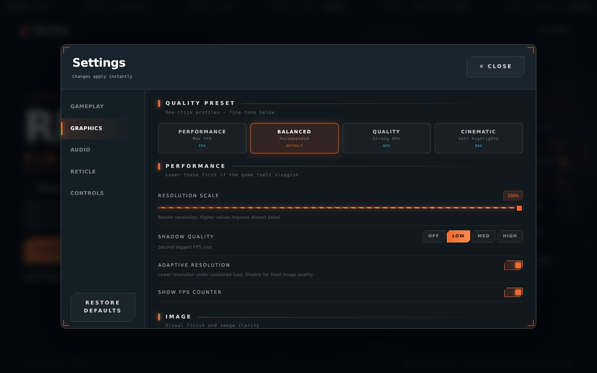
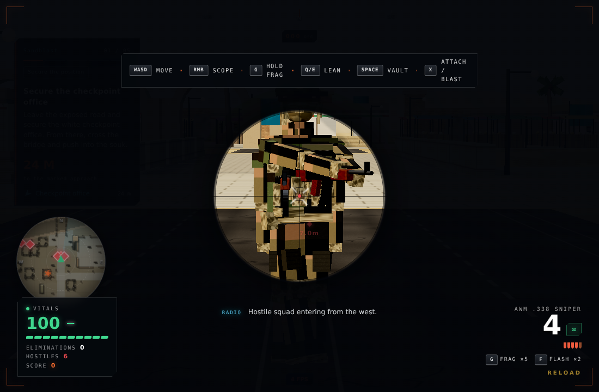
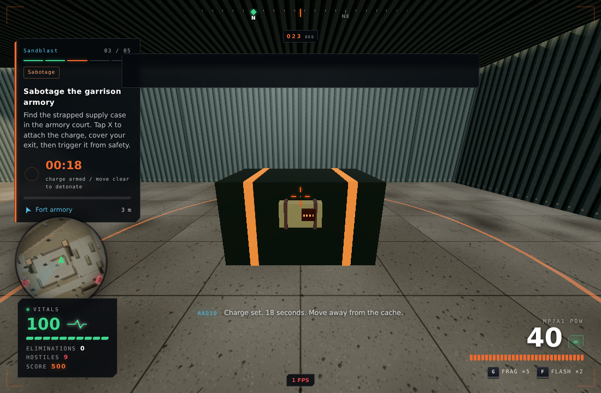
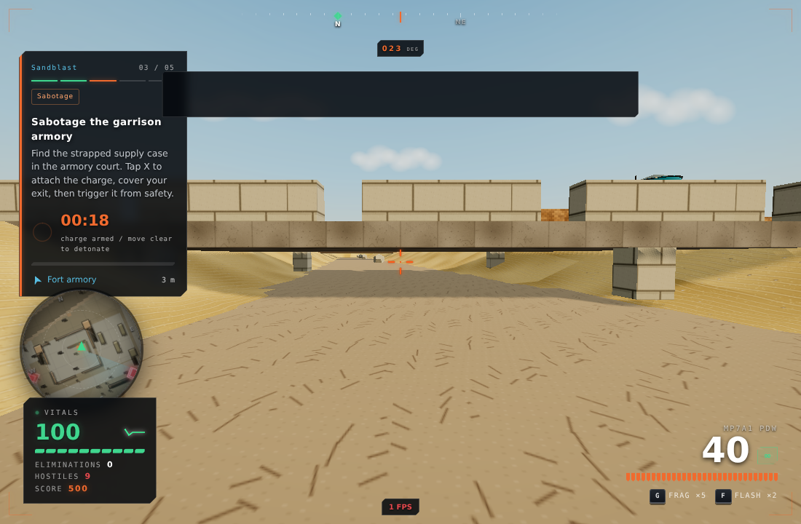
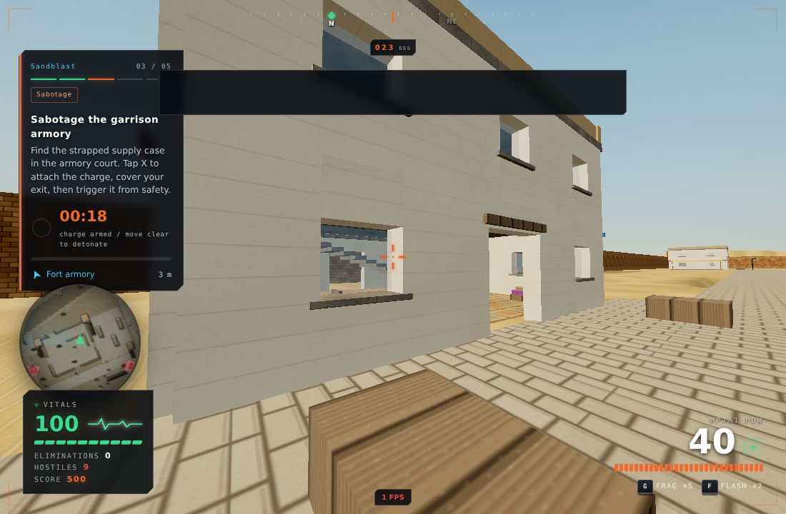

# Sandblast / Town — environment, handling and stability pass

## Environment and missions

- The public map names are **Sandblast** and **Town**. Internal save/config IDs remain compatible.
- Playable width/depth expands outward from **208 → 248 m** and **224 → 268 m**, approximately **1.2× in each horizontal dimension**. Doorways, stairs, weapons and existing combat spaces are not stretched. Four new two-storey outer buildings per map and connecting courtyard lanes occupy the expansion.
- Building families now mix shuttered residences, roof tanks, shaded shopfronts and crenellated workshops. Workshop interiors have workbenches/tool cases/pottery rather than copying the bedroom furnishing. Shutters flank windows, keeping vault openings unobstructed.
- The opening objectives have moved off the carriageway: the **checkpoint office** in Sandblast and **workshop lookout** in Town. Their small arrival regions are inside authored, reachable rooms. Existing caches remain in the armory shelter/side court, not on a road.
- Objective types have distinct HUD labels and perimeter colours. Demolition now takes **1.8 seconds** to attach and has an **18-second backup fuse**, while retaining the optional remote blast. A physical strapped charge, dark control panel and indicator lights appear on the case during attachment and disappear on detonation.
- Physical signage uses title case instead of oversized all-caps text; the previous map names/System Link decoration are removed from the menus.

## Bridge and terrain repairs

Previously the height function returned the bridge deck as “ground.” A player underneath could be snapped upward even though the mesh was overhead. Ground height now always returns the riverbed; capsule support independently selects a reachable deck. Navigation uses its own bridge-aware surface height, preserving both crossings for squads. Piers leave the central underpass clear.

Walking down a slope previously entered the falling/landing branch repeatedly. The expanded outskirts also taper the riverbed back to grade rather than ending in a vertical height discontinuity, and outer paving stops at the banks. Grounded actors now follow small downhill changes without triggering the landing dip. Footsteps, camera bob and gun sway use actual travelled distance with a continuous phase, rather than input against a wall or a phase that jumps when a footstep fires.

## Weapons and audio

| Item | Result |
|---|---|
| AWM view | The entire first-person weapon and muzzle flash are excluded from the scoped view; no receiver, scope mount or arm blocks the reticle. |
| AWM damage | 78 close-range body damage. Browser probe: **100 → 22 HP**. Headshots retain their multiplier. |
| AWM cycle | Every shot lowers ADS, cycles the visible bolt and gates aiming/firing for **1.25 s**. Magazine reload: **2.25 s tactical / 2.7 s empty**. |
| MP7 | Wider receiver, vents, controls, ejection-port detail, magazine ribs and open-ended optic. **900 RPM**, mild controlled recoil, revised hip handling and a tighter report. |
| Running | Continuous distance-driven arm/gun bob; less exaggerated sprint rotation; no fake footsteps from pushing against walls. |
| Tracers | Brighter short travelling streaks for player and enemy fire, still in a fixed reusable pool. Damage remains hitscan. |
| Sound | Slight pitch/noise-offset variation, explicit transient-node cleanup and a bounded spatial/echo voice set. |
| Radio | Full short sentences instead of chopped 46-character fragments, more natural pitch/rate, and stale enemy chatter cannot queue behind current speech. Uses the browser’s available voices, not a new recorded voice cast. |

## Menus and graphics

Main-menu routes use a compact two-column layout. Non-scrolling shells use `overflow: clip`, preventing focus/animation layers from scrolling the entire screen when a map is selected. Settings opens on Graphics, has an opaque clean panel, Performance/Balanced/Quality/Cinematic profiles and an **Adaptive resolution** toggle. Default resolution is 100%, with a bounded high-DPI cap. Fullscreen is in the menu/pause utility area rather than over live gameplay.

Both maps were measured at **1280×800, 1280×720, 1024×600, 390×844 and 844×390**: zero menu scroll overflow and all checked controls/route sections inside the viewport. Settings itself retains a scrollable options pane.

## Stability work and evidence

- Failed AI paths now honour a cooldown instead of retrying every brain tick. A regression probe records **one search across 30 ticks** for a failed stationary goal. The A* priority heap also repairs its ordering after a decreased score.
- Static architecture no longer regenerates its shadow map every third frame; construction, graphics changes, restoration and demolition invalidate it explicitly.
- Resolution does not oscillate while paused/hidden and identical pixel ratios do not resize render targets.
- Radar generation rasterises bounding rectangles rather than checking every sampled pixel against every collider.
- Spatial audio/echo tails are bounded; transient sound nodes disconnect when finished. Scene materials/textures are released on retirement.
- Context loss now pauses the mission and reports recovery status. A **real `WEBGL_lose_context` browser probe** lost/restored graphics: the same mission object was retained, rendering resources were rebuilt, and Resume remained available. No page errors.

These are specific fixes and recovery tests, **not proof that the user's exact hardware freeze has been reproduced or that all driver stalls are eliminated**.

## Validation

- Production build, TypeScript, lint, **51 tests and 31 mutation checks**.
- Existing 18 elevated routes and squad insertion positions remain tested before/after demolition.
- New regression tests cover the expanded playable areas, room-based opening objectives, both underpasses, failed-path throttling and physical charge lifecycle.
- Browser downhill probe: from `[-30, 0, 21]` to `[-30, -2.5, 10.71]`, **zero landing dip**.
- Browser weapon/placement probes: healthy-target body hit leaves 22 HP, ADS releases, 1.25 s bolt gate, scoped model hidden, charge visible during attachment and after arming.
- Both maps passed assisted full-mission/extraction/demolition/radar/redeployment/failure runs. Peak live roster was nine. All five weapons, vault/glass, lean, slide, frag, flash and pause passed browser feature probes.

World geometry is deliberately budgeted for the expanded environment: **112k / 65k triangles maximum**, keeping the **20 world-draw ceiling**. Measured intact/destroyed: Sandblast **110,150 / 110,772**, Town **63,418 / 64,244** triangles. The separate mission visuals have a five-draw/640-triangle ceiling. These are not full-frame FPS measurements.

### In-engine captures

Captures use staged QA cameras/targets and, for weapon/mission probes, controlled state. Paused screenshot FPS labels are not gameplay benchmarks.

The game remains procedural, stylised low-poly art. This pass does not claim photorealistic assets, an unassisted human difficulty sign-off, a 10/10 subjective score, or a hardware-independent minimum frame rate.
